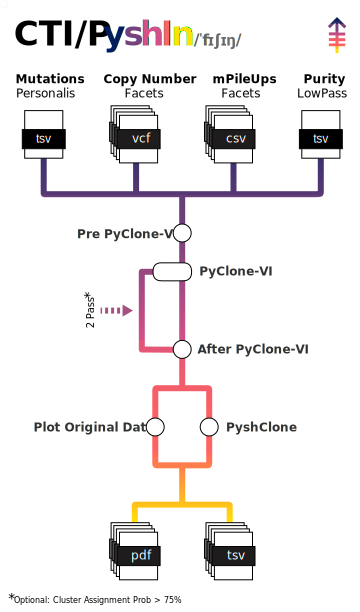

# MSKCC/CMO/CTI/PyshIn

[](https://www.nextflow.io/)
[](https://github.com/nf-core/tools/releases/tag/3.4.1)
[](https://docs.conda.io/en/latest/)
[](https://www.docker.com/)
[](https://sylabs.io/docs/)

## Introduction

<picture>
  <source media="(prefers-color-scheme: dark)" srcset="assets/PyshIn_metro_dark.svg">
  
</picture>

**PyshIn — Pythonic Phylo-Clonal Fisheries by Innovation Lab** is a Nextflow/nf-core style pipeline for multi-sample clonality analysis. It unifies variant calling, SNP pileups, copy-number and sample purity, builds equalised inputs for **PyClone-VI**, runs clonal clustering, and post-processes results to generate publication-ready visualisations (pairwise density, box/violin, flow plots, clonal trees, bell curves and fish plots).

At a glance the workflow:
- **PREPVI**: unify per-sample mutation/SNP/CNV and purity; standardise `mutation_id` and copy-number; emit `<PATIENT>_PyCloneVI_INN.tsv`.
- **PYCLONEVI_FULL**: run PyClone-VI; emit `<PATIENT>_PyCloneVI_OUT.tsv`.
- **AFTPVI**: join drivers and reshape to plotting formats; emit `<PATIENT>_PyClone_EditedData.tsv` and `<PATIENT>_PyshClon_OriginalData.tsv`.
- **PYSHCLONE / PhyShy**: infer clonal models and plot bells, spheres, trees and **fish plots**; emit PDFs in `03_outs/<PATIENT>/`.

## Pipeline summary

- Input harmonisation (SNV/indel VAF/CCF, per-site ref/alt, purity).
- Copy-number annotation per mutation (`major_cn`, `minor_cn`, `normal_cn`).
- Equalised multi-sample table for PyClone-VI.
- PyClone-VI clustering with bootstrap-based model support.
- Build the models (based on CloneEvol logic), test them for biological plausivility and produce the final tables, logs and figures:
  - Escaled table (if need it)
  - Log in json format
  - Pairwise CCF scatter matrix
  - Box/violin by cluster × sample
  - Flow plots over timepoints
  - Clonal tree, bell curves and cell plots
  - Fish plot with timepoint labels

## Usage

> [!NOTE]
> If you are new to Nextflow and nf-core, please refer to [this page](https://nf-co.re/docs/usage/installation) on how to set-up Nextflow. Make sure to [test your setup](https://nf-co.re/docs/usage/introduction#how-to-run-a-pipeline) with `-profile test` before running the workflow on actual data.
> [!NOTE]
> The best practice is to create a dedicated conda environment to install nf-core and Nextflow.

To run SVtorm follow these steps:

First, prepare the structure of the project, the ideal structure would be like follows:

```
PROJECT/
├── 01_data/
│   ├── MUT
|   |   └── mutations.maf
│   ├── PTY
|   |   └── purity.tsv
│   ├── VCF
|   |   ├── P0001_Tumour1_copynumber.vcf
|   |   ├── P0001_Plasma1_copynumber.vcf
|   |   ├── P0001_Plasma2_copynumber.vcf
|   |   └── P0001_Plasma3_copynumber.vcf
│   └── SNV
|       ├── P0001_Tumour1_snvs.vcf
|       ├── P0001_Plasma1_snvs.vcf
|       ├── P0001_Plasma2_snvs.vcf
|       └── P0001_Plasma3_snvs.vcf
├── 02_code/
│   └── run_PyshIn.sh
├── 03_outs/
├── 04_logs/
├── 05_work/
└── 06_cach/
```

Note: Any other structure is also possible, just adjust the launching script accordingly.

Second, prepare a samplesheet with your input data that looks as follows:

`samples.csv`:

```csv
patient_id,sample_id,cnv_vcf,snp_csv,timepoint
P0001,P0001_Tumour1,../01_data/VCF/P0001/P0001_Tumour1_copynumber.vcf,/.../CSV/P0001/P0001_Tumour1_snvs.csv,0
P0001,P0001_Plasma1,../01_data/VCF/P0001/P0001_Plasma1_copynumber.vcf,/.../CSV/P0001/P0001_Plasma1_snvs.csv,4
P0001,P0001_Plasma2,../01_data/VCF/P0001/P0001_Plasma2_copynumber.vcf,/.../CSV/P0001/P0001_Plasma2_snvs.csv,7
P0001,P0001_Plasma3,../01_data/VCF/P0001/P0001_Plasma3_copynumber.vcf,/.../CSV/P0001/P0001_Plasma3_snvs.csv,10
```
Notes: timepoint is an integer (e.g. 0, 2, 5, 7) used for ordering fish plots and longitudinal figures, should be properly scalled to reflect real timing.


2) Run
Minimal example:

bash
Always show details

Copy code
nextflow run nf-core/pyshin \
  -profile <docker|singularity|conda|your_institute> \
  --input samplesheet.csv \
  --outdir results/PyshIn \
  --patient_ids RM0001
Common flags:

--patient_ids: comma-separated list (if omitted, all patients in the sheet are processed)

--max_cpus, --max_memory: pipeline-level resource guards

--physhy_boots 1000: number of bootstrap samples for model support

--founding_cluster 1: enforce a founding clone label if known

Outputs (per patient)
03_outs/<PATIENT>/

<PATIENT>_PyCloneVI_INN.tsv – equalised input for PyClone-VI (per-sample ref/alt, CN, purity)

<PATIENT>_PyCloneVI_OUT.tsv – PyClone-VI clustering output

<PATIENT>_PyClone_EditedData.tsv – wide table for CloneEvol-style plots (VAF/CCF per sample)

<PATIENT>_PyshClon_OriginalData.tsv – direct counts-derived CCFs

<PATIENT>_PyshClone_PairWise*.pdf, _BoxPlot*.pdf, _FlowPlot*.pdf

<PATIENT>_PhyShy_Tree.pdf, _Bells.pdf, _Spheres.pdf (if enabled)

<PATIENT>_PyshClone_FishPlot.pdf

Configuration
Requires Nextflow ≥ 25.04 and Java 11+.

Any of Docker, Singularity/Apptainer or Conda/Mamba are supported via profiles.

Institute profiles may set scheduler params (e.g. Slurm) and container URIs.

For MSKCC Iris, use -profile iris,singularity (if provided in conf/), or supply your own custom config via -c.

Warning Provide parameters on the CLI or via -params-file. Custom Nextflow configs (-c) may override resources and profiles but not parameters.

Reproducibility
All steps are containerised; random seeds are exposed where applicable.

Intermediate tables are versioned and written to patient-specific folders to simplify provenance.

Credits
nf-core/pyshin is developed by Juan Blanco Heredia (MSKCC Innovation Lab) with contributions from colleagues across CMO/CTI.

How to cite
Once released, cite the PyshIn Zenodo DOI (to be added).

Cite the nf-core framework: Ewels et al., Nat Biotechnol. 2020; doi: 10.1038/s41587-020-0439-x.

See CITATIONS.md for third-party tools bundled by the pipeline.